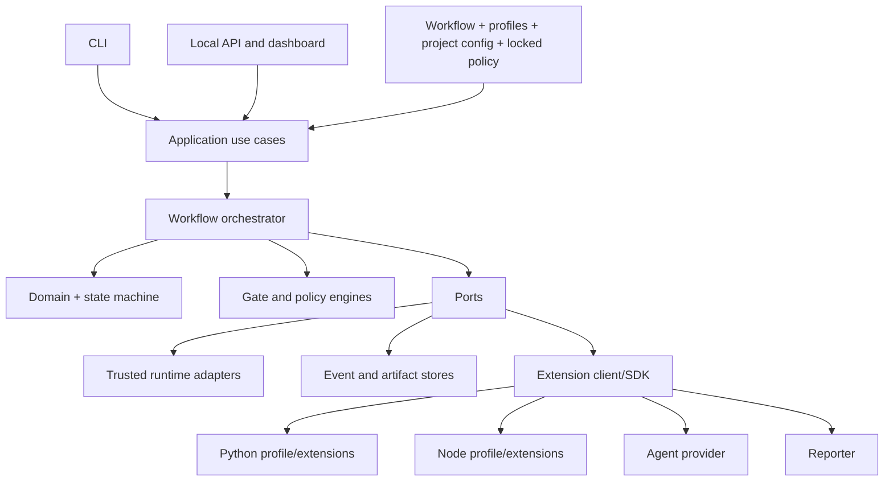
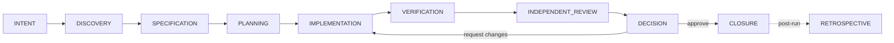

# Governed Agent Harness

**Un plano de control local que gobierna el desarrollo de software asistido por IA: fases normativas, gates que fallan cerrados y decisiones humanas vinculadas al cambio exacto.**

[](https://github.com/SebasBarrera/harness-engineering/actions/workflows/ci.yml)
[](https://github.com/SebasBarrera/harness-engineering/actions/workflows/codeql.yml)
[](https://github.com/SebasBarrera/harness-engineering/actions/workflows/security.yml)
[](https://github.com/SebasBarrera/harness-engineering/actions/workflows/docs-smoke.yml)
[](https://sonarcloud.io/summary/new_code?id=SebasBarrera_harness-engineering)
[](https://sonarcloud.io/summary/new_code?id=SebasBarrera_harness-engineering)
[](https://sonarcloud.io/summary/new_code?id=SebasBarrera_harness-engineering)
[](https://sonarcloud.io/summary/new_code?id=SebasBarrera_harness-engineering)
[](https://securityscorecards.dev/viewer/?uri=github.com/SebasBarrera/harness-engineering)
[](https://github.com/SebasBarrera/harness-engineering/releases)
[](pyproject.toml)
[](LICENSE)

[English](README.md) · Español · [Sitio de documentación](https://sebasbarrera.github.io/harness-engineering/) (en inglés)

> [!WARNING]
> Beta de investigación. **Esto no es un sandbox**: los comandos que ejecuta el harness conservan
> los permisos de tu usuario del sistema operativo y el tablero local no tiene autenticación. Lee
> [Esto no es un sandbox](#esto-no-es-un-sandbox) antes de usarlo con código en el que no confías.

## Contenido

- [Qué es y qué no es](#qué-es-y-qué-no-es)
- [Conceptos](#conceptos)
- [Arquitectura](#arquitectura)
- [Inicio rápido en cinco minutos](#inicio-rápido-en-cinco-minutos)
- [Instalación](#instalación)
- [Guía greenfield](#guía-greenfield)
- [Guía brownfield](#guía-brownfield)
- [Archivo de tarea](#archivo-de-tarea)
- [CLI](#cli)
- [Códigos de salida](#códigos-de-salida)
- [Decisiones humanas](#decisiones-humanas)
- [Configuración](#configuración)
- [Perfiles tecnológicos](#perfiles-tecnológicos)
- [Agentes externos](#agentes-externos)
- [Tablero web y API](#tablero-web-y-api)
- [Esto no es un sandbox](#esto-no-es-un-sandbox)
- [Métricas y monitoreo](#métricas-y-monitoreo)
- [Benchmarks](#benchmarks)
- [Solución de problemas](#solución-de-problemas)
- [Limitaciones y defectos conocidos](#limitaciones-y-defectos-conocidos)
- [Hoja de ruta](#hoja-de-ruta)
- [Contexto académico](#contexto-académico)
- [Contribuir, seguridad y licencia](#contribuir-seguridad-y-licencia)

## Qué es y qué no es

El harness **no es un agente ni un modelo**. Es el entorno que gobierna a uno: recibe una tarea
estructurada, la recorre por **nueve fases normativas que no se pueden eliminar**
(`INTENT`, `DISCOVERY`, `SPECIFICATION`, `PLANNING`, `IMPLEMENTATION`, `VERIFICATION`,
`INDEPENDENT_REVIEW`, `DECISION`, `CLOSURE`), concede capacidades con denegación por defecto,
ejecuta validadores sin shell, calcula el conjunto exacto de cambios propiedad de la ejecución
frente a un baseline (el **ChangeSet**), registra eventos encadenados por digest, evalúa un
**gate que falla cerrado** y exige una **decisión humana vinculada al digest del ChangeSet**. Si el
código cambia después, la aprobación deja de aplicar.

| «Ejecuta los tests» escrito en un prompt | La misma regla aplicada por el harness |
|---|---|
| El agente puede ejecutarlos o no | `VERIFICATION` es una fase obligatoria de toda ejecución |
| «Los tests pasaron» es una afirmación en una transcripción | `python.pytest` es un validador obligatorio; su código de salida y su salida se guardan como evidencia direccionada por contenido |
| Una herramienta ausente parece un éxito o se ignora | Ningún resultado no exitoso se convierte en éxito: `BLOCKED`, `ERROR`, `INCONCLUSIVE`, `TIMED_OUT` mantienen el gate cerrado |
| «Aprobar» se refiere a una tarea o una conversación | La aprobación se vincula al digest del ChangeSet, la configuración y la política exactos |

**No** es un sandbox, ni un servicio de CI, ni un reemplazo de Git o de los pull requests, y no
tiene integración nativa con ningún agente o proveedor de modelos en particular.

Stack: Python ≥ 3.12, Pydantic 2, Typer, FastAPI y Uvicorn (extra opcional `api`), PyYAML,
JSON Schema 2020-12, SQLite. Licencia: Apache-2.0.

## Conceptos

| Término | Significado |
|---|---|
| **Harness** | El entorno de control alrededor de un agente: fases, capacidades, validadores, evidencia, gates y decisiones. |
| **Fase normativa** | Una de las nueve fases obligatorias. Un workflow no puede quitarlas ni reordenarlas. |
| **Validador** | Una comprobación que devuelve un estado normalizado (`PASSED`, `FAILED`, `BLOCKED`, `ERROR`, `TIMED_OUT`, `INCONCLUSIVE`, `NOT_APPLICABLE`, `SKIPPED`, …): pruebas, linters, verificadores de tipos, la revisión independiente. |
| **Evidencia / artefacto** | Un artefacto son bytes guardados por su digest (un diff, la salida de una herramienta). La evidencia es el registro que declara qué sostiene un artefacto, en qué fase y quién lo produjo. Los artefactos se redactan antes de guardarse. |
| **ChangeSet** | Los archivos propiedad de la ejecución (paths de los parches declarados o `metadata.ownedPaths`) que cambiaron frente al baseline capturado al inicio, con un digest canónico. |
| **Digest** | SHA-256 sobre una representación canónica: del ChangeSet, de la instantánea de configuración, de la política, de cada evento (cadena de hashes). |
| **Capacidad** | Una concesión para una clase de acción (`filesystem.write`, `process.execute`, …) acotada a paths o comandos; todo lo demás se deniega. |
| **Gate** | La consolidación de los resultados de validación y hallazgos del digest vigente en `PASSED`, `FAILED`, `INCONCLUSIVE`, … con códigos de razón. |
| **Decisión humana** | `APPROVE`, `APPROVE_EXCEPTION`, `REQUEST_CHANGES` o `REJECT`, registrada con actor y justificación y vinculada al digest vigente del ChangeSet. |

## Arquitectura





Las dependencias apuntan hacia adentro: el dominio no conoce la CLI, el framework web, los perfiles
ni los proveedores; los validadores producen resultados pero solo el motor de gates decide; los
reportes nunca cambian el estado. Detalles en [ARCHITECTURE.md](ARCHITECTURE.md), los
[ADR](docs/adr) y el [modelo de confianza](docs/architecture/trust-model.md). Fuentes de los
diagramas: [`diagrams/`](diagrams).

## Inicio rápido en cinco minutos

Requiere Python ≥ 3.12 y Git. El workflow `docs-smoke` ejecuta estos pasos en cada push, con el
harness instalado desde el código fuente (`scripts/demo_flows.py quickstart`), y verifica cada
código de salida que aparece aquí.

```bash
python3.12 -m venv .venv && source .venv/bin/activate
pip install "governed-agent-harness @ https://github.com/SebasBarrera/harness-engineering/releases/download/v1.0.0/governed_agent_harness-1.0.0-py3-none-any.whl" pytest

# un proyecto Python mínimo con un commit de baseline
mkdir pricing-demo && cd pricing-demo && mkdir -p src/pricing tests
printf 'def apply_discount(subtotal: float, threshold: float, rate: float) -> float:\n    return subtotal\n' > src/pricing/__init__.py
printf 'from pricing import apply_discount\n\n\ndef test_below_threshold() -> None:\n    assert apply_discount(99, 100, 0.1) == 99\n' > tests/test_pricing.py
printf '[project]\nname = "pricing-demo"\nversion = "0.1.0"\n\n[tool.pytest.ini_options]\npythonpath = ["src"]\n' > pyproject.toml
printf '.harness/\n' > .gitignore
git init -q && git add . && git commit -qm baseline

harness init                                    # código 0: escribe .harness/project.yaml
curl -sSLO https://raw.githubusercontent.com/SebasBarrera/harness-engineering/develop/docs/guides/task.yaml
harness task create --file task.yaml            # código 0
harness run start --task task_discount_rule     # código 4: fases automáticas superadas, espera tu decisión
harness status --run <run-id>                   # fases, gate PASSED, digest del ChangeSet
harness gate decide --run <run-id> --decision APPROVE \
  --change-set-digest <sha256:… de status> --actor tu-nombre --rationale "Criterios cubiertos por pruebas"
harness trace --run <run-id> --format markdown --output trace.md
```

La tarea usada es [`docs/guides/task.yaml`](docs/guides/task.yaml); la
[guía greenfield](docs/guides/greenfield.md) recorre el mismo flujo con todas las salidas.

## Instalación

| Desde | Comando |
|---|---|
| Un wheel del release (recomendado) | `pip install <URL del wheel en la página del release>`; verifícalo con `sha256sum -c SHA256SUMS` y `gh attestation verify <wheel> --repo SebasBarrera/harness-engineering` |
| Código fuente | `git clone https://github.com/SebasBarrera/harness-engineering && cd harness-engineering && pip install -e ".[dev,api]"` |
| Docker | `docker run --rm ghcr.io/sebasbarrera/harness-engineering:1.0.0 --help` (publicada desde `v1.0.0`; corre con un usuario sin privilegios) |

Requisitos: **Python ≥ 3.12** y **Git** (los baselines y ChangeSets salen del repositorio). Para
proyectos Node.js, **Node.js LTS y npm**. El extra opcional `api` instala FastAPI y Uvicorn para el
tablero. El harness es un paquete de Python: **no se instala con npm ni con npx**. No está publicado
en PyPI.

## Guía greenfield

Resumen de la [guía greenfield completa](docs/guides/greenfield.md) (en inglés), que muestra la
salida real de cada paso:

1. Crea el proyecto (`pyproject.toml` y pruebas, o `package.json` con un script `test`) y **haz un
   commit de baseline**: el ChangeSet se calcula contra él.
2. `harness init`, `harness inspect` (perfil detectado, confianza y evidencia), `harness doctor
   --path .`, `harness config validate`.
3. Escribe `task.yaml`: intención, requisitos, criterios de aceptación y, para una ejecución
   determinista, una implementación `patch`.
4. `harness task create --file task.yaml` y luego `harness run start --task <id>` → código **4**.
5. `harness status --run <id>`, `harness findings list`, `harness evidence list`.
6. `harness gate decide … --change-set-digest <digest vigente>` → código **0**.
7. `harness trace --format markdown|json|jsonl|sarif`, `harness retrospect` (las recomendaciones
   nunca se aplican solas; `harness recommendation decide` registra si una persona acepta, edita o
   rechaza cada una). El harness nunca hace commit: revisa `git diff` y haz el commit tú.

## Guía brownfield

La [guía brownfield](docs/guides/brownfield.md) (en inglés) reproduce el caso de la tesis sobre el
repositorio real `pallets/itsdangerous` 2.2.0 (archivo del tag en GitHub, SHA-256 `7b0c6d41…37f2b`).
Qué cambia frente a un proyecto nuevo:

- **Árbol limpio o baseline conocido.** Los cambios que existen antes de la ejecución forman parte
  del baseline y quedan fuera del ChangeSet.
- **Instala las dependencias de prueba del proyecto donde corre el harness.** En el caso faltaba
  `freezegun` (declarada en `requirements/tests.txt`): `run start` terminó con **6** y la salida de
  pytest guardada mostró dos módulos de prueba que no se recolectaban, fuera del ChangeSet.
- **Dos salidas ante un baseline roto:** corregirlo y ejecutar `harness run continue` (el caso corrió
  entonces **298 pruebas**, todas satisfactorias, con el mismo digest del ChangeSet; el gate cuenta
  el último intento de cada validador, así que quedó en `PASSED` y un `APPROVE` simple cerró la
  ejecución: 46 eventos, cadena válida), o cerrar con `APPROVE_EXCEPTION` y una justificación
  escrita. En el corte evaluado 0.8.0 el gate conservaba el fallo del primer intento y el caso cerró
  por excepción.
- **Respeta las convenciones.** La detección es de solo lectura (en el caso: Python, confianza 1,0
  por `pyproject.toml` y `tox.ini`). Varios lockfiles elevan la confianza de Node.js, pero el perfil
  siempre ejecuta `npm`.

`examples/brownfield-itsdangerous/reproduce.sh` ejecuta el caso completo y verifica cada código de
salida.

## Archivo de tarea

Una tarea es YAML o JSON: `taskId`, `title`, `intent`, `requirements`, `acceptanceCriteria`,
`constraints`, `implementation` (`mode: none | patch | command`, `patches`) y `metadata` (por ejemplo
`ownedPaths`). La [referencia del archivo de tarea](docs/reference/task-file.md) se genera desde
[`schemas/v1/task.schema.json`](schemas/v1/task.schema.json). Incluye siempre `title` e `intent`: si
falta uno, hoy se guarda el texto `None` (issue #29).

## CLI

30 comandos (referencia completa con todas las opciones, generada desde el código:
[docs/reference/cli.md](docs/reference/cli.md)):

| Grupo | Comandos |
|---|---|
| Proyecto | `init`, `inspect`, `doctor`, `config validate` |
| Tareas | `task create`, `task list`, `task show`, `task questions`, `task clarify` |
| Ejecuciones | `run start`, `run continue`, `run cancel`, `run list`, `status` |
| Evidencia | `evidence list`, `findings list`, `trace`, `retrospect` |
| Memoria | `memory add`, `memory list`, `memory manifest`, `memory approve`, `memory invalidate` |
| Recomendaciones | `recommendation list`, `recommendation decide` |
| Decisión | `gate decide` |
| Extensiones y benchmarks | `plugins list`, `benchmark run`, `benchmark scenarios` |
| Tablero | `api serve` |

Todos los comandos aceptan `--help`; los comandos de proyecto reciben `--path` (por defecto, el
directorio actual).

## Códigos de salida

| Código | Significado |
|---:|---|
| `0` | Éxito |
| `1` | Error del harness o de una integración |
| `2` | Error de configuración (configuración ausente o inválida, tarea ilegible, `doctor` fallido) |
| `3` | No encontrado (ejecución, tarea o registro) |
| `4` | **Fases automáticas superadas; hay una decisión humana pendiente** |
| `5` | Violación de política (digest obsoleto, `APPROVE` sobre un gate que no pasó, decisión fuera de `DECISION`) |
| `6` | Bloqueo (validación, política, tiempo agotado o resultado no concluyente) |
| `130` | Cancelado |

En CI, **el 4 no es un fallo**: la automatización llegó al límite de su autoridad y una persona debe
decidir. Ver [códigos de salida](docs/reference/exit-codes.md) y la
[guía de CI](docs/guides/ci-integration.md).

## Decisiones humanas

| Decisión | Cuándo | Salvaguarda |
|---|---|---|
| `APPROVE` | El gate está en `PASSED` | Se rechaza con 5 si el gate no pasó |
| `APPROVE_EXCEPTION` | Aceptar un cambio cuyo gate no pasó | Exige justificación; queda visible en la traza |
| `REQUEST_CHANGES` | Devolver la ejecución a `IMPLEMENTATION` | Invalida verificación, revisión y gate |
| `REJECT` | Cerrar sin aceptar | |

Toda decisión lleva el digest **vigente** del ChangeSet. Si un archivo propio cambia después de
evaluado el gate, el digest anterior se rechaza con 5 (`prior approval is stale`); `run continue`
reevalúa el gate, que pasa a `INCONCLUSIVE` con la razón `NO_MANDATORY_VALIDATIONS` porque las
validaciones pertenecen al digest anterior; registra `REQUEST_CHANGES`, continúa y vuelve a decidir.
Esta secuencia se prueba en cada push (`scripts/demo_flows.py later-change`).

## Configuración

`harness init` escribe `.harness/project.yaml`: perfiles (`auto`), workflow, concesiones de
capacidades, validadores, políticas, proveedores de agente y límites de ejecución. Cuatro políticas
están **bloqueadas** y no se pueden debilitar: `requireHumanDecision`, `approvalDigestBinding`,
`mandatoryNonSuccessBlocks` (siempre `true`) y `retrospectiveAutoApply` (siempre `false`).
`findingBlockSeverities` (por defecto `HIGH` y `CRITICAL`) y `allowEmptyChangeSet` son configurables.
`runtime.allowNetwork`, `runtime.maxParallel`, `retention` y `workspace.units` son **declarativos:
nada los aplica**. `intake.criteriaPolicy` decide qué hace `INTENT` con criterios de aceptación que
no se pueden observar ("It works."): `enforce` (lo escribe `init`) bloquea hasta que una persona
responda las preguntas con `harness task clarify`, `warn` (un archivo sin la clave) las registra como
evidencia y hallazgos `LOW`, y `off` omite la verificación. Referencia completa: [docs/reference/configuration.md](docs/reference/configuration.md).

## Perfiles tecnológicos

| Perfil | Se detecta por | Validador obligatorio | Opcionales (si están disponibles) |
|---|---|---|---|
| Python | `pyproject.toml`, `requirements.txt`, `pytest.ini`, … | `python -m pytest -q` | `python -m ruff check .`, `python -m mypy .` |
| Node.js | `package.json` y lockfiles | `npm test --silent` (necesita un script `test`) | `npm run lint`, `npm run typecheck` (si están definidos) |

Un validador opcional ausente queda en `NOT_APPLICABLE`; un ejecutable obligatorio ausente queda en
`BLOCKED`.

## Agentes externos

Un agente se conecta mediante el **proveedor por comando**: un programa registrado en
`agentProviders` que recibe la tarea y el plan como JSON por la entrada estándar e imprime un objeto
JSON (`{"status": "PASSED" | "FAILED" | "BLOCKED", "summary": "…"}`, opcionalmente con el `usage` que
reporta el agente) por la salida estándar. Cuando el proyecto tiene memoria gobernada vigente, la
petición también la lleva en `context` ([guía de memoria](docs/guides/memory.md)).
`examples/structured-command-agent.py` es un ejemplo funcional. **No hay integración nativa con
Claude Code, Codex ni ninguna API de modelos**: se conectan mediante un envoltorio de ese tipo; hay
una plantilla en la [guía de agentes externos](docs/guides/external-agents.md). El proveedor solo
propone un cambio; la verificación, la revisión, el gate y la decisión siguen en manos del harness.

## Tablero web y API

`harness api serve --path . --host 127.0.0.1 --port 8765` (requiere el extra `api`) sirve el
tablero en `/` y nueve rutas: `GET /api/health`, `/api/runs`, `/api/runs/{id}`,
`/api/runs/{id}/trace`, `/evidence`, `/findings`, `/retrospective` y
`POST /api/runs/{id}/decision`. **Sin autenticación, sin roles y sin soporte multiusuario:
mantenlo en loopback.** Referencia: [docs/reference/api.md](docs/reference/api.md).

## Esto no es un sandbox

El harness aplica controles a nivel de aplicación: capacidades con denegación por defecto,
contención de rutas (se rechazan traversal y escapes por enlaces simbólicos), procesos sin shell con
límite de tiempo, cancelación y tope de salida, redacción de secretos antes de persistir,
decisiones vinculadas al digest y un registro de eventos encadenado. **No** aísla los procesos que
lanza: un comando autorizado conserva los permisos de sistema de archivos, red, CPU y memoria de tu
usuario. `allowNetwork` no se aplica. La cadena de eventos hace detectable una alteración, no la
impide. Ejecuta repositorios, agentes o extensiones en los que no confías solo dentro de un
contenedor o una máquina virtual. Ver [SECURITY.md](SECURITY.md).

## Métricas y monitoreo

Cada ejecución reporta 20 métricas de proceso (duraciones, intentos, ciclos de corrección y de
revisión, validaciones, ChangeSets, decisiones, tokens, costo) con una calidad declarada:
`OBSERVED`, `DERIVED`, `REPORTED` o `NOT_AVAILABLE`. **No hay métricas por persona**, por diseño, y
tokens y costo quedan en `NOT_AVAILABLE` porque ningún proveedor incluido reporta consumo. Se leen
con `harness status`, la traza JSON o `GET /api/runs/{id}`. Detalles: [docs/metrics.md](docs/metrics.md).
Señales de salud del repositorio y qué hacer con ellas: [docs/monitoring.md](docs/monitoring.md).

## Benchmarks

Microbenchmarks sintéticos de transiciones de estado, evaluación de gates, hashing, escritura de
eventos, almacenamiento de artefactos y lanzamiento de procesos gobernado frente a directo, ejecutados
cinco veces por cada push a `develop` y `main`, con un
[reporte](https://sebasbarrera.github.io/harness-engineering/benchmarks/report/) y una
[tendencia](https://sebasbarrera.github.io/harness-engineering/benchmarks/trend/). Miden sobrecarga
de ejecución en runners compartidos, no productividad ni calidad. Ver
[docs/benchmarks.md](docs/benchmarks.md).

## Solución de problemas

| Síntoma | Causa y solución |
|---|---|
| `run start` termina con 6 y estado `BLOCKED`; la validación `python.pytest` dice `mandatory Python module 'pytest' is not installed for 'python'` | `pytest` no está instalado en el entorno donde corre el harness. Instálalo y ejecuta `harness run continue`. |
| Una ejecución brownfield falla con módulos de prueba que no se recolectan | Instala las dependencias de prueba del proyecto (por ejemplo `pip install -r requirements/tests.txt`) y ejecuta `run continue`. |
| `gate decide` termina con 5: `prior approval is stale` | Un archivo propio cambió después del gate. Consulta el digest vigente con `harness status` o ejecuta `run continue` para reevaluar. |
| `gate decide` termina con 5: `APPROVE is only valid for a passed automatic gate` | El gate no pasó. Usa `REQUEST_CHANGES`, `REJECT` o `APPROVE_EXCEPTION` con justificación. |
| `harness init` termina con 2: `configuration already exists` | El proyecto ya está inicializado; usa `--force` para reemplazar la configuración. |

## Limitaciones y defectos conocidos

Defectos de comportamiento abiertos (hito
[backlog — thesis-impact](https://github.com/SebasBarrera/harness-engineering/milestone/3)); el tag
`v0.8.0` conserva el comportamiento evaluado, la 0.9.0 corrigió #1, #2, #9, #19, #29, #30 y #31, y la
1.0.0 hizo operable la memoria (#6) ([changelog](CHANGELOG.md)):

- [#3](https://github.com/SebasBarrera/harness-engineering/issues/3) la configuración de fases del workflow (capacidades, intentos, tiempos, gates de salida) se registra pero no se aplica;
- [#4](https://github.com/SebasBarrera/harness-engineering/issues/4) las capacidades se resuelven por ejecución y no por fase, y las concesiones del proyecto se suman a las del perfil;
- [#5](https://github.com/SebasBarrera/harness-engineering/issues/5) `allowNetwork` y otros ajustes declarados no se aplican;
- [#7](https://github.com/SebasBarrera/harness-engineering/issues/7) no se distinguen errores preexistentes de errores introducidos;
- [#8](https://github.com/SebasBarrera/harness-engineering/issues/8) no hay checkpoint de aprobación del plan.

Limitaciones declaradas: sin aislamiento a nivel de sistema operativo
([#18](https://github.com/SebasBarrera/harness-engineering/issues/18)), sin autenticación ni soporte
multiusuario en el tablero, sin ejecución distribuida, sin firma externa de la evidencia, sin
integraciones nativas con proveedores, y métricas de tokens y costo solo cuando un proveedor las
reporta.

## Hoja de ruta

- Decidir y resolver el resto del backlog `thesis-impact` cuando se cierre la evaluación de la tesis (#3–#8).
- Aplicar capacidades por fase y los ajustes del workflow que hoy solo se registran (#3, #4).
- Un adaptador de sandbox a nivel de sistema operativo (contenedor) y una política de red aplicada (#5, #18).
- Distinguir fallos preexistentes de fallos introducidos en repositorios brownfield (#7).
- Adaptadores de proveedores que reporten consumo de tokens y costo.

## Contexto académico

Este software es el artefacto de la tesis de maestría *Diseño y evaluación de una arquitectura de
harness engineering para el desarrollo de software asistido por inteligencia artificial, con
supervisión humana y retrospectiva basada en evidencia* (Juan Sebastián Barrera Pulido, Maestría en
Informática, Escuela Colombiana de Ingeniería Julio Garavito). La tesis evalúa
[**v0.8.0**](https://github.com/SebasBarrera/harness-engineering/releases/tag/v0.8.0), que reproduce
byte a byte el corte evaluado ([procedencia](docs/provenance.md)).

Snapshot reportado por la tesis para v0.8.0 (los badges de CI muestran el estado actual):

| Hecho | v0.8.0 |
|---|---|
| Módulos / líneas de Python en `src/governed_harness` | 74 / 6.746 |
| Contratos JSON Schema · comandos de la CLI · rutas de la API | 25 · 21 · 9 |
| Pruebas | 86 (núcleo 79, E2E Python 4, E2E Node.js 1, rendimiento 2) |
| Cobertura del núcleo | líneas 80,60 %, ramas 59,29 % (77,48 % combinada) |
| Sobrecarga del proceso gobernado | 10,09 % y 11,23 % (cerca de 1,2 ms) |
| Caso brownfield | itsdangerous 2.2.0, 298 pruebas, digest del ChangeSet invariante |

Más en [docs/thesis.md](docs/thesis.md). Para citar el software, usa [CITATION.cff](CITATION.cff)
(«Cite this repository» en GitHub).

## Contribuir, seguridad y licencia

- [CONTRIBUTING.md](CONTRIBUTING.md): entorno, comandos de verificación, flujo de ramas y las reglas
  que protegen el corte evaluado. [Código de conducta](CODE_OF_CONDUCT.md). [Soporte](SUPPORT.md).
- [SECURITY.md](SECURITY.md): reporta vulnerabilidades de forma privada a través de GitHub.
- Licencia [Apache 2.0](LICENSE).
