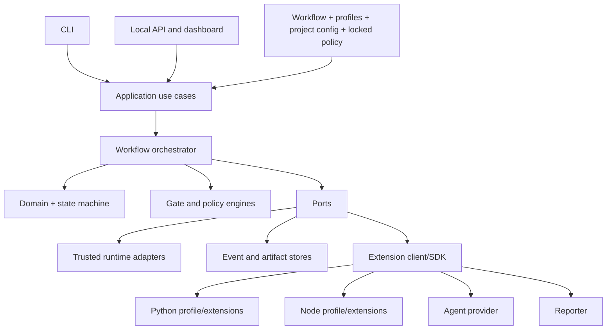
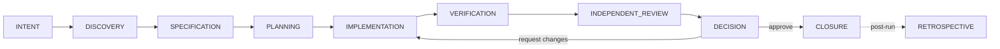

# Governed Agent Harness

**A local control plane that governs AI-assisted software development: normative phases, fail-closed gates and human decisions bound to the exact change.**

[](https://github.com/SebasBarrera/harness-engineering/actions/workflows/ci.yml)
[](https://github.com/SebasBarrera/harness-engineering/actions/workflows/codeql.yml)
[](https://github.com/SebasBarrera/harness-engineering/actions/workflows/security.yml)
[](https://github.com/SebasBarrera/harness-engineering/actions/workflows/docs-smoke.yml)
[](https://sonarcloud.io/summary/new_code?id=SebasBarrera_harness-engineering)
[](https://sonarcloud.io/summary/new_code?id=SebasBarrera_harness-engineering)
[](https://sonarcloud.io/summary/new_code?id=SebasBarrera_harness-engineering)
[](https://sonarcloud.io/summary/new_code?id=SebasBarrera_harness-engineering)
[](https://securityscorecards.dev/viewer/?uri=github.com/SebasBarrera/harness-engineering)
[](https://github.com/SebasBarrera/harness-engineering/releases)
[](pyproject.toml)
[](LICENSE)

English · [Español](README.es.md) · [Documentation site](https://sebasbarrera.github.io/harness-engineering/)

> [!WARNING]
> Research beta. **This is not a sandbox**: the commands the harness runs keep the permissions of
> your OS user, and the local dashboard has no authentication. Read
> [This is not a sandbox](#this-is-not-a-sandbox) before using it on code you do not trust.

## Contents

- [What it is, and what it is not](#what-it-is-and-what-it-is-not)
- [Concepts](#concepts)
- [Architecture](#architecture)
- [Quickstart in five minutes](#quickstart-in-five-minutes)
- [Installation](#installation)
- [Greenfield guide](#greenfield-guide)
- [Brownfield guide](#brownfield-guide)
- [Task file](#task-file)
- [CLI](#cli)
- [Exit codes](#exit-codes)
- [Human decisions](#human-decisions)
- [Configuration](#configuration)
- [Technology profiles](#technology-profiles)
- [External agents](#external-agents)
- [Web dashboard and API](#web-dashboard-and-api)
- [This is not a sandbox](#this-is-not-a-sandbox)
- [Metrics and monitoring](#metrics-and-monitoring)
- [Benchmarks](#benchmarks)
- [Troubleshooting](#troubleshooting)
- [Limitations and known defects](#limitations-and-known-defects)
- [Roadmap](#roadmap)
- [Academic context](#academic-context)
- [Contributing, security and license](#contributing-security-and-license)

## What it is, and what it is not

The harness is **not an agent and not a model**. It is the environment that governs one: it takes a
structured task, drives it through **nine normative phases that cannot be removed**
(`INTENT`, `DISCOVERY`, `SPECIFICATION`, `PLANNING`, `IMPLEMENTATION`, `VERIFICATION`,
`INDEPENDENT_REVIEW`, `DECISION`, `CLOSURE`), grants capabilities deny-by-default, runs validators
without a shell, computes the exact set of changes owned by the run against a baseline (the
**ChangeSet**), records hash-chained events, evaluates a **fail-closed gate** and requires a
**human decision bound to the ChangeSet digest**. If the code changes afterwards, the approval no
longer applies.

| "Run the tests" written in a prompt | The same rule applied by the harness |
|---|---|
| The agent may or may not run them | `VERIFICATION` is a mandatory phase of every run |
| "Tests passed" is a claim in a transcript | `python.pytest` is a mandatory validator; its exit code and output are stored as content-addressed evidence |
| A missing tool looks like success, or is ignored | Non-success never becomes success: `BLOCKED`, `ERROR`, `INCONCLUSIVE`, `TIMED_OUT` all keep the gate closed |
| "Approve" refers to a task or a conversation | An approval is bound to the digest of the exact ChangeSet, configuration and policy |

It is **not** a sandbox, not a CI service, not a replacement for Git or pull requests, and it has no
native integration with a particular agent or model provider.

Stack: Python ≥ 3.12, Pydantic 2, Typer, FastAPI and Uvicorn (optional `api` extra), PyYAML,
JSON Schema 2020-12, SQLite. License: Apache-2.0.

## Concepts

| Term | Meaning |
|---|---|
| **Harness** | The control environment around an agent: phases, capabilities, validators, evidence, gates and decisions. |
| **Normative phase** | One of the nine mandatory phases. A workflow may not remove or reorder them. |
| **Validator** | A check that returns a normalized status (`PASSED`, `FAILED`, `BLOCKED`, `ERROR`, `TIMED_OUT`, `INCONCLUSIVE`, `NOT_APPLICABLE`, `SKIPPED`, …): tests, linters, type checkers, the independent review. |
| **Evidence / artifact** | An artifact is bytes stored by content digest (a diff, a tool's stdout). Evidence is the record stating what an artifact supports, in which phase, by whom. Artifacts are redacted before they are stored. |
| **ChangeSet** | The files the run owns (declared patch paths, or `metadata.ownedPaths`) that changed against the baseline captured at the start, with a canonical digest. |
| **Digest** | SHA-256 over a canonical representation: of the ChangeSet, of the configuration snapshot, of the policy, of each event (hash chain). |
| **Capability** | A grant for a class of action (`filesystem.write`, `process.execute`, …) scoped to paths or commands; everything else is denied. |
| **Gate** | The consolidation of the validation results and findings of the current digest into `PASSED`, `FAILED`, `INCONCLUSIVE`, … with reason codes. |
| **Human decision** | `APPROVE`, `APPROVE_EXCEPTION`, `REQUEST_CHANGES` or `REJECT`, recorded with actor and rationale and bound to the current ChangeSet digest. |

## Architecture





Dependencies point inward: the domain knows no CLI, web framework, profile or provider; validators
produce results but only the gate engine decides; reporters never change state. Details in
[ARCHITECTURE.md](ARCHITECTURE.md), the [ADRs](docs/adr) and the
[trust model](docs/architecture/trust-model.md). Diagram sources: [`diagrams/`](diagrams).

## Quickstart in five minutes

Requires Python ≥ 3.12 and Git. The `docs-smoke` workflow runs these steps on every push, with the
harness installed from source (`scripts/demo_flows.py quickstart`), and checks every exit code shown.

```bash
python3.12 -m venv .venv && source .venv/bin/activate
pip install "governed-agent-harness @ https://github.com/SebasBarrera/harness-engineering/releases/download/v1.0.0/governed_agent_harness-1.0.0-py3-none-any.whl" pytest

# a tiny Python project with a baseline commit
mkdir pricing-demo && cd pricing-demo && mkdir -p src/pricing tests
printf 'def apply_discount(subtotal: float, threshold: float, rate: float) -> float:\n    return subtotal\n' > src/pricing/__init__.py
printf 'from pricing import apply_discount\n\n\ndef test_below_threshold() -> None:\n    assert apply_discount(99, 100, 0.1) == 99\n' > tests/test_pricing.py
printf '[project]\nname = "pricing-demo"\nversion = "0.1.0"\n\n[tool.pytest.ini_options]\npythonpath = ["src"]\n' > pyproject.toml
printf '.harness/\n' > .gitignore
git init -q && git add . && git commit -qm baseline

harness init                                    # exit 0: writes .harness/project.yaml
curl -sSLO https://raw.githubusercontent.com/SebasBarrera/harness-engineering/develop/docs/guides/task.yaml
harness task create --file task.yaml            # exit 0
harness run start --task task_discount_rule     # exit 4: automated phases passed, waiting for you
harness status --run <run-id>                   # phases, gate PASSED, ChangeSet digest
harness gate decide --run <run-id> --decision APPROVE \
  --change-set-digest <sha256:… from status> --actor you --rationale "Criteria covered by tests"
harness trace --run <run-id> --format markdown --output trace.md
```

The task used here is [`docs/guides/task.yaml`](docs/guides/task.yaml); the
[greenfield guide](docs/guides/greenfield.md) walks through the same flow with every output.

## Installation

| From | Command |
|---|---|
| A release wheel (recommended) | `pip install <wheel URL from the release page>`; verify it with `sha256sum -c SHA256SUMS` and `gh attestation verify <wheel> --repo SebasBarrera/harness-engineering` |
| Source | `git clone https://github.com/SebasBarrera/harness-engineering && cd harness-engineering && pip install -e ".[dev,api]"` |
| Docker | `docker run --rm ghcr.io/sebasbarrera/harness-engineering:1.0.0 --help` (published from `v1.0.0`; runs as a non-root user) |

Requirements: **Python ≥ 3.12** and **Git** (baselines and ChangeSets come from the repository). For
Node.js projects, **Node.js LTS and npm**. The optional `api` extra installs FastAPI and Uvicorn for
the dashboard. The harness is a Python package: **it is not installed with npm or npx**. It is not
published on PyPI.

## Greenfield guide

Summary of the [full greenfield guide](docs/guides/greenfield.md), which shows the real output of
every step:

1. Create the project (`pyproject.toml` and tests, or `package.json` with a `test` script) and
   **commit a baseline**: the ChangeSet is computed against it.
2. `harness init`, `harness inspect` (detected profile, confidence and evidence), `harness doctor
   --path .`, `harness config validate`.
3. Write `task.yaml`: intent, requirements, acceptance criteria and, for a deterministic run, a
   `patch` implementation.
4. `harness task create --file task.yaml`, then `harness run start --task <id>` → exit **4**.
5. `harness status --run <id>`, `harness findings list`, `harness evidence list`.
6. `harness gate decide … --change-set-digest <current digest>` → exit **0**.
7. `harness trace --format markdown|json|jsonl|sarif`, `harness retrospect` (recommendations are
   never applied automatically; `harness recommendation decide` records whether a person accepts,
   edits or rejects each one). The harness never commits: review `git diff` and commit yourself.

## Brownfield guide

The [brownfield guide](docs/guides/brownfield.md) reproduces the thesis case on the real repository
`pallets/itsdangerous` 2.2.0 (GitHub tag archive, SHA-256 `7b0c6d41…37f2b`). What differs from a new
project:

- **Clean tree or known baseline.** Changes that exist before the run are part of the baseline and
  stay out of the ChangeSet.
- **Install the project's test dependencies where the harness runs.** In the case, `freezegun`
  (declared in `requirements/tests.txt`) was missing: `run start` exited with **6** and the stored
  pytest output showed two test modules failing to collect, outside the ChangeSet.
- **Two ways out of a broken baseline:** fix it and `harness run continue` (the case then ran
  **298 tests**, all passing, with the same ChangeSet digest; the gate counts the latest attempt of
  each validator, so it `PASSED` and a plain `APPROVE` closed the run: 46 events, chain valid), or
  close with `APPROVE_EXCEPTION` and a written rationale. In the evaluated 0.8.0 cut the gate kept
  the failure of the first attempt and the case closed by exception.
- **Respect conventions.** Detection is read-only (the case: Python, confidence 1.0 from
  `pyproject.toml` and `tox.ini`). Several lock files raise the Node.js confidence, but the profile
  always runs `npm`.

`examples/brownfield-itsdangerous/reproduce.sh` runs the whole case and checks every exit code.

## Task file

A task is YAML or JSON: `taskId`, `title`, `intent`, `requirements`, `acceptanceCriteria`,
`constraints`, `implementation` (`mode: none | patch | command`, `patches`) and `metadata`
(for example `ownedPaths`). The [task-file reference](docs/reference/task-file.md) is generated from
[`schemas/v1/task.schema.json`](schemas/v1/task.schema.json). Always provide `title` and `intent`:
a missing one is currently stored as the text `None` (issue #29).

## CLI

30 commands (full reference with every option, generated from the code:
[docs/reference/cli.md](docs/reference/cli.md)):

| Group | Commands |
|---|---|
| Project | `init`, `inspect`, `doctor`, `config validate` |
| Tasks | `task create`, `task list`, `task show`, `task questions`, `task clarify` |
| Runs | `run start`, `run continue`, `run cancel`, `run list`, `status` |
| Evidence | `evidence list`, `findings list`, `trace`, `retrospect` |
| Memory | `memory add`, `memory list`, `memory manifest`, `memory approve`, `memory invalidate` |
| Recommendations | `recommendation list`, `recommendation decide` |
| Decision | `gate decide` |
| Extensions and benchmarks | `plugins list`, `benchmark run`, `benchmark scenarios` |
| Dashboard | `api serve` |

Every command accepts `--help`; the project commands take `--path` (default: the current directory).

## Exit codes

| Code | Meaning |
|---:|---|
| `0` | Success |
| `1` | Harness or integration error |
| `2` | Configuration error (no or invalid project configuration, unparsable task, failed `doctor`) |
| `3` | Not found (run, task or record) |
| `4` | **Automated phases passed; a human decision is pending** |
| `5` | Policy violation (stale digest, `APPROVE` over a gate that did not pass, decision outside `DECISION`) |
| `6` | Blocked (validation, policy, timeout or inconclusive result) |
| `130` | Cancelled |

In CI, **4 is not a failure**: automation reached the limit of its authority and a person must
decide. See [exit codes](docs/reference/exit-codes.md) and the [CI guide](docs/guides/ci-integration.md).

## Human decisions

| Decision | When | Guard |
|---|---|---|
| `APPROVE` | The gate `PASSED` | Refused with 5 if the gate did not pass |
| `APPROVE_EXCEPTION` | Accept a change whose gate did not pass | Requires a rationale; stays visible in the trace |
| `REQUEST_CHANGES` | Send the run back to `IMPLEMENTATION` | Invalidates verification, review and gate |
| `REJECT` | Close without accepting | |

Every decision carries the **current** ChangeSet digest. If an owned file changes after the gate
was evaluated, the old digest is refused with 5 (`prior approval is stale`); `run continue`
re-evaluates the gate, which becomes `INCONCLUSIVE` with reason `NO_MANDATORY_VALIDATIONS` because
the validations belong to the previous digest; record `REQUEST_CHANGES`, continue, and decide again.
This sequence is tested on every push (`scripts/demo_flows.py later-change`).

## Configuration

`harness init` writes `.harness/project.yaml`: profiles (`auto`), workflow, capability grants,
validators, policies, agent providers and runtime limits. Four policies are **locked** and cannot be
weakened: `requireHumanDecision`, `approvalDigestBinding`, `mandatoryNonSuccessBlocks` (always
`true`) and `retrospectiveAutoApply` (always `false`). `findingBlockSeverities` (default `HIGH`,
`CRITICAL`) and `allowEmptyChangeSet` are configurable. `runtime.allowNetwork`,
`runtime.maxParallel`, `retention` and `workspace.units` are **declarative: nothing enforces them**.
`intake.criteriaPolicy` decides what `INTENT` does with acceptance criteria that cannot be observed
("It works."): `enforce` (written by `init`) blocks until a person answers the questions with
`harness task clarify`, `warn` (a file without the key) records them as evidence and `LOW`
findings, `off` skips the check.
`verification.requirementTraceability` decides what `VERIFICATION` does with a requirement that
carries an identifier (`A1. ...`, `[B12] ...` or an explicit `requirementId`) and that no test
names: `enforce` (written by `init`) records a `HIGH` finding, so the gate is `FAILED`; `warn`
records a `LOW` finding; `off` (a file without the key) skips the check.
Full reference: [docs/reference/configuration.md](docs/reference/configuration.md).

## Technology profiles

| Profile | Detected by | Mandatory validator | Optional (when available) |
|---|---|---|---|
| Python | `pyproject.toml`, `requirements.txt`, `pytest.ini`, … | `python -m pytest -q` | `python -m ruff check .`, `python -m mypy .` |
| Node.js | `package.json` and lock files | `npm test --silent` (needs a `test` script) | `npm run lint`, `npm run typecheck` (if defined) |

An absent optional validator is `NOT_APPLICABLE`; an absent mandatory executable is `BLOCKED`.

## External agents

An agent is connected through the **command provider**: a program registered in
`agentProviders` that receives the task and plan as JSON on stdin and prints one JSON object
(`{"status": "PASSED" | "FAILED" | "BLOCKED", "summary": "…"}`, optionally with the `usage` the
agent reports) on stdout. When the project has governed memory in force, the request also carries
it under `context` ([memory guide](docs/guides/memory.md)).
`examples/structured-command-agent.py` is a working example. There is **no native integration with
Claude Code, Codex or any model API**: they are connected through such a wrapper; a template is in
the [external agents guide](docs/guides/external-agents.md). The provider only proposes a change;
verification, review, the gate and the decision stay with the harness.

## Web dashboard and API

`harness api serve --path . --host 127.0.0.1 --port 8765` (requires the `api` extra) serves the
dashboard at `/` and nine routes: `GET /api/health`, `/api/runs`, `/api/runs/{id}`,
`/api/runs/{id}/trace`, `/evidence`, `/findings`, `/retrospective`, and
`POST /api/runs/{id}/decision`. **No authentication, no roles, no multi-user support: keep it on
loopback.** Reference: [docs/reference/api.md](docs/reference/api.md).

## This is not a sandbox

The harness enforces application-level controls: deny-by-default capabilities, path containment
(traversal and symlink escapes are rejected), shell-free processes with timeouts, cancellation and
output bounds, secret redaction before persistence, digest-bound decisions and a hash-chained event
log. It does **not** isolate the processes it launches: an authorized command keeps the file-system,
network, CPU and memory permissions of your OS user. `allowNetwork` is not enforced. The event chain
makes tampering detectable, not impossible. Run untrusted repositories, agents or plugins only inside
a container or VM. See [SECURITY.md](SECURITY.md).

## Metrics and monitoring

Each run reports 20 process metrics (durations, attempts, correction and review cycles, validations,
ChangeSets, decisions, tokens, cost) with a declared quality: `OBSERVED`, `DERIVED`, `REPORTED` or
`NOT_AVAILABLE`. There are **no per-person metrics**, by design, and token and cost values stay
`NOT_AVAILABLE` because no built-in provider reports usage. Read them with `harness status`, the JSON
trace or `GET /api/runs/{id}`. Details: [docs/metrics.md](docs/metrics.md). Repository health
signals and what to do with them: [docs/monitoring.md](docs/monitoring.md).

## Benchmarks

Synthetic microbenchmarks of state transitions, gate evaluation, hashing, event appends, artifact
storage and governed versus direct process launch, run five times per push to `develop` and `main`,
with a [report](https://sebasbarrera.github.io/harness-engineering/benchmarks/report/) and a
[trend](https://sebasbarrera.github.io/harness-engineering/benchmarks/trend/). They measure runtime
overhead on shared runners, not productivity or quality. See [docs/benchmarks.md](docs/benchmarks.md).

## Troubleshooting

| Symptom | Cause and fix |
|---|---|
| `run start` exits 6 with status `BLOCKED`; the `python.pytest` validation says `mandatory Python module 'pytest' is not installed for 'python'` | `pytest` is not installed in the environment where the harness runs. Install it and `harness run continue`. |
| Brownfield run fails with test modules that do not collect | Install the project's test dependencies (for example `pip install -r requirements/tests.txt`) and `run continue`. |
| `gate decide` exits 5: `prior approval is stale` | An owned file changed after the gate. Run `harness status` for the current digest, or `run continue` to re-evaluate. |
| `gate decide` exits 5: `APPROVE is only valid for a passed automatic gate` | The gate did not pass. Use `REQUEST_CHANGES`, `REJECT`, or `APPROVE_EXCEPTION` with a rationale. |
| `harness init` exits 2: `configuration already exists` | The project is already initialized; use `--force` to replace the configuration. |

## Limitations and known defects

Open behavioral defects (milestone
[backlog — thesis-impact](https://github.com/SebasBarrera/harness-engineering/milestone/3)); the
`v0.8.0` tag keeps the evaluated behavior, 0.9.0 fixed #1, #2, #9, #19, #29, #30 and #31, and
1.0.0 made memory operable (#6) ([changelog](CHANGELOG.md)):

- [#3](https://github.com/SebasBarrera/harness-engineering/issues/3) workflow phase settings (capabilities, attempts, timeouts, exit gates) are recorded but not enforced;
- [#4](https://github.com/SebasBarrera/harness-engineering/issues/4) capabilities are resolved per run, not per phase, and project grants add to profile grants;
- [#5](https://github.com/SebasBarrera/harness-engineering/issues/5) `allowNetwork` and other declared settings are not enforced;
- [#7](https://github.com/SebasBarrera/harness-engineering/issues/7) pre-existing and introduced errors are not distinguished;
- [#8](https://github.com/SebasBarrera/harness-engineering/issues/8) there is no plan-approval checkpoint.

Declared limitations: no OS-level isolation ([#18](https://github.com/SebasBarrera/harness-engineering/issues/18)), no
authentication or multi-user support in the dashboard, no distributed execution, no external
signature of evidence, no native provider integrations, token and cost metrics only when a provider
reports them.

## Roadmap

- Decide and resolve the rest of the `thesis-impact` backlog once the thesis evaluation is closed (#3–#8).
- Enforce phase-scoped capabilities and the workflow settings that are recorded today (#3, #4).
- An OS-level sandbox adapter (container) and enforced network policy (#5, #18).
- Distinguish pre-existing from introduced failures in brownfield repositories (#7).
- Provider adapters that report token and cost usage.

## Academic context

This software is the artifact of the master's thesis *Diseño y evaluación de una arquitectura de
harness engineering para el desarrollo de software asistido por inteligencia artificial, con
supervisión humana y retrospectiva basada en evidencia* (Juan Sebastián Barrera Pulido, Maestría en
Informática, Escuela Colombiana de Ingeniería Julio Garavito). The thesis evaluates
[**v0.8.0**](https://github.com/SebasBarrera/harness-engineering/releases/tag/v0.8.0), which reproduces
the evaluated cut byte for byte ([provenance](docs/provenance.md)).

Snapshot reported by the thesis for v0.8.0 (the CI badges show the current state):

| Fact | v0.8.0 |
|---|---|
| Python modules / lines in `src/governed_harness` | 74 / 6,746 |
| JSON Schema contracts · CLI commands · API routes | 25 · 21 · 9 |
| Tests | 86 (core 79, E2E Python 4, E2E Node.js 1, performance 2) |
| Core coverage | lines 80.60 %, branches 59.29 % (77.48 % combined) |
| Governed-process overhead | 10.09 % and 11.23 % (about 1.2 ms) |
| Brownfield case | itsdangerous 2.2.0, 298 tests, invariant ChangeSet digest |

More in [docs/thesis.md](docs/thesis.md). To cite the software, use [CITATION.cff](CITATION.cff)
("Cite this repository" on GitHub).

## Contributing, security and license

- [CONTRIBUTING.md](CONTRIBUTING.md): setup, verification commands, branch flow and the rules that
  protect the evaluated cut. [Code of conduct](CODE_OF_CONDUCT.md). [Support](SUPPORT.md).
- [SECURITY.md](SECURITY.md): report vulnerabilities privately through GitHub.
- Licensed under the [Apache License 2.0](LICENSE).
