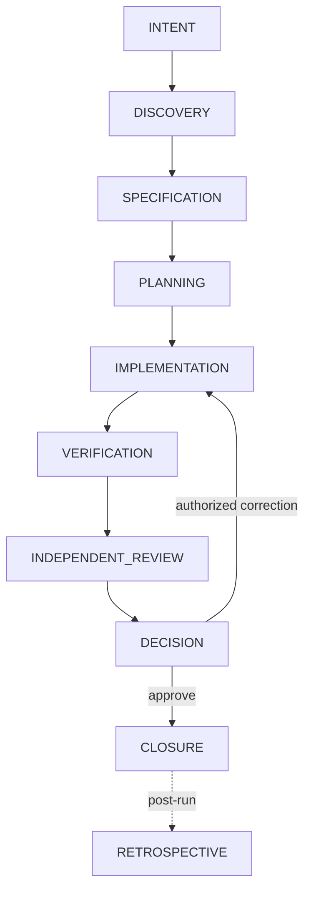
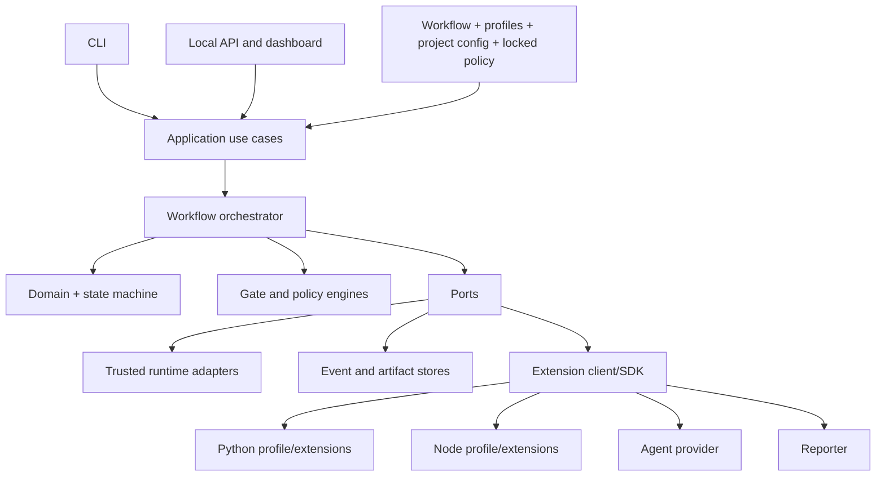

# Governed Agent Harness

A local **control plane** for AI-assisted software development. It is not an agent and not a
model: it takes a structured task, drives it through nine normative phases that cannot be removed,
grants capabilities deny-by-default, runs validators without a shell, computes the exact set of
changes owned by the run against a baseline (the **ChangeSet**), records hash-chained events,
evaluates a fail-closed gate and requires a **human decision bound to the ChangeSet digest**. If
the code changes afterwards, the approval no longer applies.

> [!WARNING]
> Research beta. **It is not a sandbox**: a process the harness launches keeps the file-system,
> network, CPU and memory permissions of your user. The local dashboard requires a local bearer
> token only under the `api` section that `harness init` writes (none without it) and must stay on
> loopback.

## A narrative instruction versus an applied control

| "Run the tests" in a prompt | The same rule in the harness |
|---|---|
| The agent may or may not run them | `VERIFICATION` is a mandatory phase of every run |
| "Tests passed" is a claim in the transcript | `python.pytest` is a mandatory validator; its exit code, stdout and stderr are stored as content-addressed evidence |
| A missing tool looks like success or is ignored | A non-success result never becomes success; the gate fails closed |
| Approval is about "the task" | Approval is bound to the digest of the exact ChangeSet, configuration and policy |

## Normative phases

## Architecture

## Where to start

- [Greenfield guide](guides/greenfield.md): a governed change on a new project, step by step.
- [Brownfield guide](guides/brownfield.md): a real third-party repository with a broken baseline.
- [External agents](guides/external-agents.md): connect an agent CLI through the command provider.
- [CLI reference](reference/cli.md) and [exit codes](reference/exit-codes.md).
- [Metrics](metrics.md) and [benchmarks](benchmarks.md).
- Reports: [benchmark report](https://sebasbarrera.github.io/harness-engineering/benchmarks/report/), [trend](https://sebasbarrera.github.io/harness-engineering/benchmarks/trend/),
  [coverage](https://sebasbarrera.github.io/harness-engineering/coverage/), [process metrics](https://sebasbarrera.github.io/harness-engineering/metrics-report/).
- [Thesis context](thesis.md) and [provenance of the evaluated cut](provenance.md).
